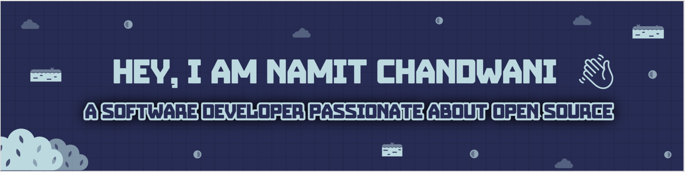

    

  
---  
   
   
### About Me  
  
I'm a Computer Science Engineering graduate from BITS Pilani, Goa Campus, with a passion for software development and enjoy contributing to the tech community.  

 

---
  
### 💻 What I Do  
  
- **At Groww**: Led enhancements for Groww’s Authentication and Authorization microservice, managing a peak throughput of 258,000 requests per minute while ensuring secure user access and system reliability for 73.3 million users.
  
- **Google Summer of Code (GSoC) 2021**: Selected from over 7,500 applicants to work with the JBoss Community (Red Hat), contributing to open source projects.  
  
- **Open Source Contributions**: Regularly contribute to open source projects to support and learn from the community.  

---
  

### 🏆 Activities and Interests  
  
- **Hackathons**:  
- 🥇 Winner at Techweekend Spring 2020  
- 🥈 2nd Runner-Up at DevFest Hackathon 2020  
- 🏅 People's Choice award at Groww Hackraft Hackathon 2023  
  
- **Research**: Co-authored an IEEE paper focused on connecting NGOs and volunteers through software.  
  
---

### 👨‍🏫 Community Involvement  
  
- Enjoy mentoring and judging at hackathons.
- Judged at AlbanyHacks 2020 and mentored at Helix Hacks Hackathon to support and inspire high-school students.  
  
---

### 🛠️ Technologies & Tools

\

---

### Projects and Dev Stuffs:

  
<b>⚡ Github Stats</b>

 
 

 
 

 

  
<b>☄️ Github Streaks</b>

---
  
### 📫 Connect with Me  
  
- LinkedIn: [linkedin.com/in/namit-chandwani](https://in.linkedin.com/in/namit-chandwani)  
- Twitter: [@NamitChandwani](https://twitter.com/NamitChandwani)

   

   
Thank you for visiting my GitHub profile! Feel free to check out my repositories and get in touch if you want to collaborate on exciting projects.

Like My Work?

